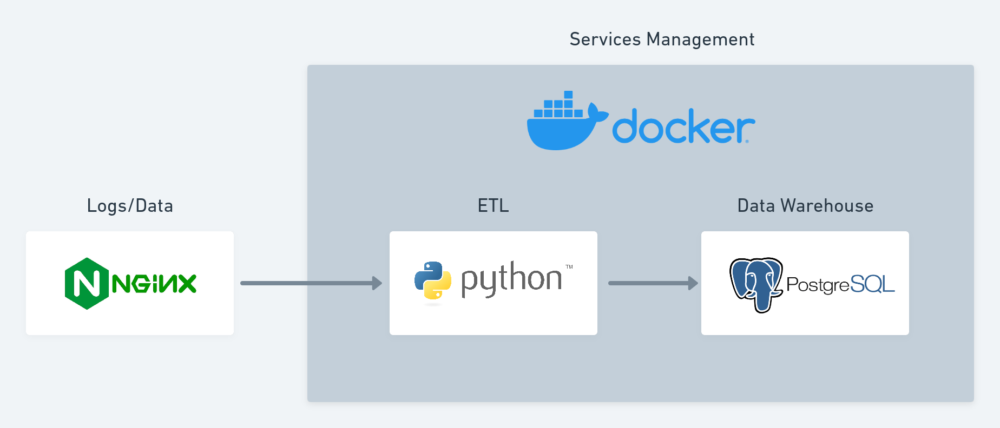

# Log Parsing - Data Analyticslog-parsing-data-analytics
A solution to read a log file from a Nginx application and parse it into a SQL database for analytics.

## Summary
1. [Steps to run](#1-steps-to-run)
2. [Architecture](#2-architecture)
2.5 [Data Warehouse](#21-data-warehouse)
2.2 [Services Management](#22-services-management)
2.3 [Data](#23-data)
2.4 [ETL](#24-etl)

## 1. Steps to Run
1. Git clone this repository and move into it:
``` bash
git clone https://github.com/israelmendez232/log-parsing-data-analytics.git
cd ./log-parsing-data-analytics
```

2. Modify and copy the `.env.sample` with the credentials you may prefer:
``` bash
cd ./app
cp .env.sample .env
```

3. Enter on the `app` folder on where the scripts are running. And run the containers:
``` bash
docker-compose up
```

The application will print every step, such as the ETL and the results for analytics based on the request on status code. 

## 2. Architecture
The application is like: <br>


The steps:
1. **Data:** an application generates a file `nginx.log` with all what it's happening inside and the requests;
2. **Services Management:** Using docker and docker-compose to manage all services;
3. **ETL:** Uses Python to transform and load the data into the Data Warehouse;
4. **Data Warehouse:** Using PostgreSQL to store the data to read.

### 2.1 Data Warehouse
The storage of the data is using PostgreSQL. The maing pattern here is to devide the DW into schemas with specific purposes:
1. **Raw:** Receive the raw log data and add inside of the DW, ina structured format. Adding with partitions;
2. **Trusted:** Retrieve the data in raw, collects the last partition and provide consistent numbers.

Here is a table to be more clear:
| **Zones** | **Partition** | **Source** |
|-----------|---------------|------------|
| Raw       | Yes           | Logs       |
| Trusted   | No            | Raw        |

The objective is to break into roles the type of access of the data warehouse:
| **Type of User** | **Example**                  | **Raw** | **Trusted** |
|------------------|------------------------------|---------|-------------|
| Essential        | Marketing, Product           | No      | Yes         |
| Advanced         | Data Analyst, Data Scientist | No      | Yes         |
| Admin            | Data Engineer, DevOps        | Yes     | Yes         |


### 2.2 Services Management
The whole application is running on docker and docker-compose. It's based on this two containers:
- PostgreSQL: from their official image on dockerhub;
- Python: custom image that I've built on `dockerfile`. 

Also, the `./app/scripts/orchestration.py` helps to manage PostgreSQL access, users and the simulation of the logs itself, along with the ELT.

### 2.3 Data
The data is log that it's been writting by the time. A script simulate this input to writing new lines, you can check it on `./app/scripts/simulate_logs.py`.

### 2.4 ETL
The code that "extract" and transform the data into a tabular format to be consumed on SQL. The script is located on `./app/scripts/etl.py`. Is separated on:
- `raw_zone`: Script that reads the log, transform using regex into a dataframe. Adds partitions and move the data into the data warehouse;
- `trusted_zone`: Script that selects the last partition and move to a `trusted` schema.
